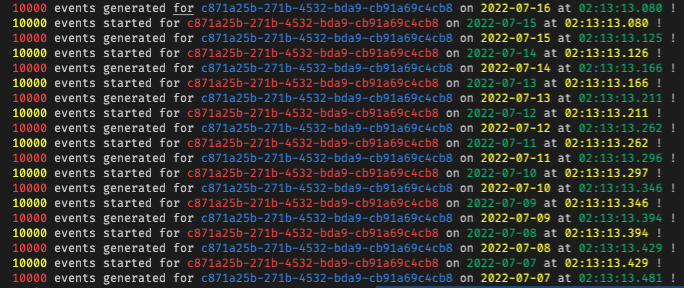

# Fauxlemetry

This console app will generate delimited data with some correlation between values. The objective is primarily to seed a starting record set for a Redis instance that will be the data plane for a Blazor server based analytics project. Initially the data will be loaded as flat files into a local Redis Stack instance - part of the targeted Blazor app's startup context. But eventually this applet will also feed small, timed packets of records directly to the Redis instance via the CLI.

## Usage

From the project directory, you can run a command similar to the following:

```shell
dotnet run g --customers c871a25b-271b-4532-bda9-cb91a69c4cb8 --volume 10000 --rewind 30 --env "redis://localhost:6379"
```

or (when running a published version of the app)

```shell
./Fauxlemetry g --customers c871a25b-271b-4532-bda9-cb91a69c4cb8 --volume 10000 --rewind 30 --env "redis://localhost:6379"
```

This will generate 30 files, as determined by the '--rewind' argument, one for each of the previous 29 days plus one for the current day. In each file will be a certain volumn of records - which is determinted by the '--volume' argument.

## Redis JSON

The records are written to a Redis-based document store. So it's assumed there's a Redis Stack or similar instance available. The default location (pictured above) is localhost - but the "env" attribute can specify any Redis instance that's reachable by this commandlet.

## Command Line Output

As files are generated the output will look similar to the following:



## Data Generation

In the short term, the objective is to generate a volume of data that has certain "event rates" for combinations of values. Because there's a business scenario that dictates these events occur with a certain incident rate and span-of-time, there needs to be a form of business rules around them. For now, the "generate" task is concerned with simply generating "day-wide" distributions of values. In the future other data "shapes" will be contemplated - such as "peak" activity times and event patterns that span multiple days.

## Near Real Time Data

Once that initial 30-day corpus of data is generated, then the console will be used to emit streams of data that simulates real time traffic as though it comes from the originating system. For now we planned to simply place Fauxlemetry on the same system as the Redis instance (such as running locally for individual dev purposes) but at some point a connection to a remote Redis endpoint will likely have a role.

## Origins

This repository is based on the template generated from the @EluciusFTW 's [FSharp Spectre.Console Template](https://github.com/EluciusFTW/fsharp-spectre-console-template). See that and the Spectre.Console site for more information.
