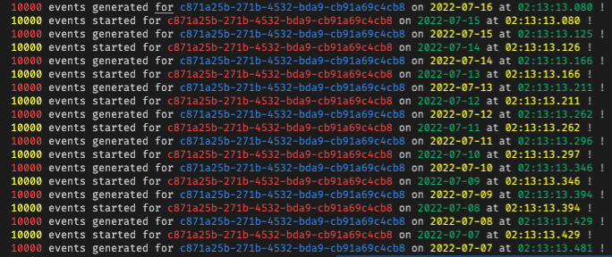
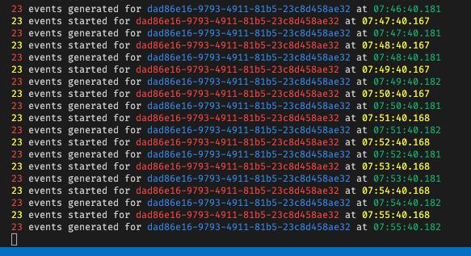

# Fauxlemetry

This console app will generate volumes of semi-randome day-spanned data for multiple days. The objective is primarily to seed a baseline record set for a Redis instance - the data plane for the a dashboard project.
## Language
Fauxlemetry is written in F#, but every attempt has been made to ensure the code is clear enough to be read by anyone with C# and/or Python experience. In fact, anyone that can understand indentation-scoped code and basic dot-notation should be able to read the inline comments and find their way though without too much head-scratching.

## The 10,000 Foot View

The data is loaded directly into a Redis Stack instance - part of the targeted Blazor app's runtime context. This project is to simulate production-scaled and scenario-based traffic to aid development of the Dashboard and related monintoring elements it will contain.

There are two commands at present - "generate" and "drip" - which are detailed below

## 'generate' Usage

From the project's directory, you can run a command similar to the following:

```bash
dotnet run g --rew 32 --vol 33500 --env "redis://localhost:6379" --flush true --idx true --cust dad86e16-9793-4911-81b5-23c8d458ae32
```

or (when running a published version of the app) run from the publish directory

```bash
./Fauxlemetry g --rew 32 --vol 33500 --env "redis://localhost:6379" --flush true --idx true --cust dad86e16-9793-4911-81b5-23c8d458ae32
```

This will generate 31 full days of data *plus* a spread of records that account for the current day up to the time of writing into Redis. This range of days is determined by the rewind '--rew' argument. The records for each day are transmitted into the instance on their own processing thread. So there is some parallelism in the process - however *inside* each day-length process processing is fully synchronous.

## Details

### Generate (g) command

The primary load of historical data is created with the "generate" (or simply "g") command. It spins up a volume of day-level events based on parameters passed in at runtime and randomized the EventDate for those records across the day. All parameters *also* have default values, so if input parameters are left out of skipped then the defaults are used. Those are each detailed below.

### rewind parameter

```fsharp
[<CommandOption("-r|--rew")>]
member val rewind: int = 32 with get, set
```

Rewind [-r or --rew] sets the number of days that the process "goes back" to set historical records. *Remember* this is 0-indexed - so the default of "32" actually means 31 full days of history *plus* on partial day's worth of records for the current day.

### volume parameter

```fsharp
[<CommandOption("-v|--vol")>]
member val volume = 10000 with get, set
```

The volume [-v or --vol] parameter sets the number of records generated for a given day. So if you pass in "--val 100000" then it will create 100,000 records for each day. Those records an spread "evenly" acros the entire day so you can think of this as creating a historical volume baseline.

If you don't pass a specific value, then the default (currently 1000) will be used.

### customer parameter

```fsharp
[<CommandOption("-c|--cust")>]
member val cst_id = Guid.NewGuid().ToString() with get, set
```

Customer [-c or --cust] is a string value of the GUID that represents a Telos customer as represented in the Customer database. If you don't supply a value, a new GUID will be generated and send into 

### environment parameter

```fsharp
[<CommandOption("-e|--env")>]
member val environment = "redis://localhost:6379" with get, set
```

Environment [-e or --env] is the connection string used to access Redis. This *may* become more complicated when use of ACLs and/or other security measures are involved. In most cases where the "default" user is assumed then you'll see something like the above. For situations where a user and password are specified the pattern will look like...

```bash
redis://[user]:[password]@[IPv4]:[port]
```

... so your mileage may vary

### flush parameter


```fsharp
[<CommandOption("-f|--flush")>]
member val flushRedis = false with get, set
```

Flush [-f or --flush] sends the Redis "FLUSHALL" command in order to reset the corpus to *empty* before you transmit records. 

The default is set to 'false' because of scenarios where you may wish to run multiple passes of the 'generate' command for successive customers - and only want to reset Redis before the *first* call in the series of commands.

### index parameter

```fsharp
[<CommandOption("-i|--idx")>]
member val indexRedis = false with get, set
```

Index [-i or --idx] creates an index for accessing records with the "Customer:" Redis key prefix. Similar to the "Flush" command above there will be scenarios where you only want to send the command once. So again here it defaults to false and would need to be set to "true" at the command line in order for the index to be sent.

## Generate Command's Console Output

As records are generated the output will look similar to the following:



Because of the multi-threaded process there will be some out-of-order start and completion of threads. This is to be expected. Once all of the records have been written then a command prompt is returned. 

At that point it is expected the user would follow with executing the "drip" command. This is to ensure that the baseline event volume in Redis remains relatively constant. 

The 'drip' command is detailed below.

### Drip (d) Command

The drip command is very similar to 'generate' with some important differences. Since the process takes the current hour and minute value of its runtime there's less randomization. Values are randomly spread across a one-minute interval instead of the full day randomization used by 'generate'. There's also no concurrency in the write to Redis since there's only a handful of records transmitted each interval (60 seconds by default). But because of the similarities there are some parameters that would largely follow the settings used for a previouis "generate" commandrun.

## Drip Usage

```bash
./Fauxlemetry d --vol 33500 --env "redis://localhost:6379" --cust dad86e16-9793-4911-81b5-23c8d458ae32 --ttl 31
```

### volume parameter

```fsharp
[<CommandOption("-v|--vol")>]
member val volume = 10000 with get, set
```

As with the generate command this sets a base per-day volume of data. This value is divided by 1440 (the number of minutes in a day) and rounded to the nearest integer value. There is an expectation of a rational value that will yield a rounded integer of 1 or greater. 

```fsharp
let recordsPerMinute : int = Convert.ToInt32(Math.Round(Decimal.Divide(settings.volume, 1440), 0))
```

Because of this rounding the number of events per-day will not be exact. But again the idea is to maintain the general base level of data day-over-day.

### customer parameter

```fsharp
[<CommandOption("-c|--cust")>]
member val cst_id = Guid.NewGuid().ToString() with get, set
```
Again, as with the generate command, this value is expected to be passed at the command runtime. The idea is that whatever client GUID was just passed in the 'generate' cycle should also be used here.

### environment parameter

```fsharp
[<CommandOption("-e|--env")>]
member val environment = "redis://localhost:6379" with get, set
```

This value should be the same as the value passed for 'generate' command that preceded it.

### ttldays parameter

```fsharp
[<CommandOption("-t|--ttldays")>]
member val ttl: int = 31 with get, set
```

This option departs from the norm - it's similar to the "rewind" parameter above in the 'generate' command but since it's not zero-indexed it's usually passed "off by one". This value is used to calculate the forward TTL date of each event (based on their epoch_timestamp value). 

So, if the default "rewind" value of 32 is taken, the corresponding "ttldays" value would be 31, which is each parameter's respective default.

## Drip Console Output

As records are 'dripped' the output will look similar to the following:



The image above is to maintain approximately 1 million records over a 30-day period. (33500 records per day / 1440 minutes per day, rounded up) This is important to understand because the parameters above help to shape data to maintain a steady 31-ish days worth of volume in Redis as time marches forward.

## Redis JSON

The Dashboard's data source is Redis with the JSON module installed - and in most cases that means simply running Redis Stack - as it also has Search and Streams available - to go with JSON document support.

## Data Generation with Follow-On 'Drips'

In the short term, the objective is to generate a volume of data that has certain "event rates" for combinations of values. Because there's a business scenario that dictates these events occur with a certain incident rate and span-of-time, there needs to be a form of business rules around them. For now, the "generate" task is concerned with simply generating "day-wide" distributions of values. The "drip" is instrumented as a means to simply maintain those "baseline" data levels in Redis as "old" records age out.

The "drip" command produces follow-on data volumes that *by convention* should maintain the event rate for a given scenario. Those events are transmitted every 60 seconds - which is understood would *not* emulate production sytems behavior. However we're looking to keep the newest data generally "at par" for the day-long time period, and will address smaller grains/cadence of data with a planned "inject" command.
## Origins

This repository is based on the template generated from the @EluciusFTW 's [FSharp Spectre.Console Template](https://github.com/EluciusFTW/fsharp-spectre-console-template). See that and the Spectre.Console site for more information.
